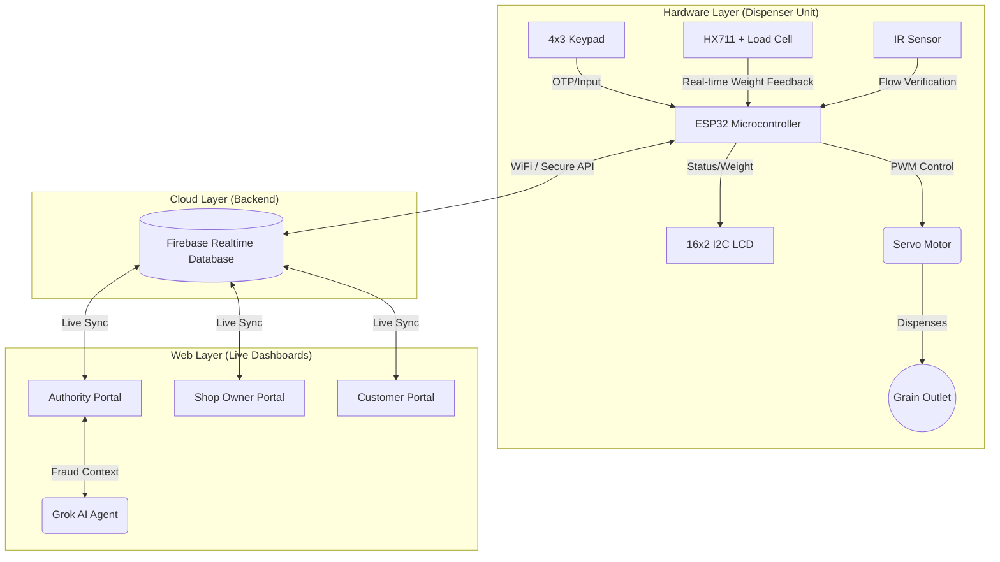

# Smart Public Distribution System (Smart PDS)

[](https://vaishakscem543.github.io/smart-public-distribution-system/)
[](https://firebase.google.com/)
[](https://x.ai)

India’s Public Distribution System (PDS) is one of the **largest food security networks in the world**, serving **over 800 million beneficiaries**. Despite large-scale digitization of records, **20–30% of subsidized food grains** are still lost annually due to physical diversion, pilferage, and manual weighing inefficiencies at the point of delivery.

**Smart PDS** solves this by introducing a **Cyber-Physical Ecosystem** that combines a physical IoT-based automated vending machine with a cloud-connected web platform. By physically automating the dispensing and enforcing closed-loop load-cell feedback, it mathematically prevents over-dispensing and diversion at the source.

👉 **[Try the Live Web Portals Here!](https://vaishakscem543.github.io/smart-public-distribution-system/)**

---

## 🧠 System Architecture

The project bridges embedded hardware and modern web technologies to create a tamper-proof pipeline from physical grain to digital audit log.



---

## 🛠️ Hardware & Firmware Implementation

The physical vending unit is built to be robust, accurate, and cost-effective for deployment at local Fair Price Shops (FPS).

* **Microcontroller:** **ESP32** handles all processing, WiFi connectivity (via `WiFiManager`), and secure JSON communication with Firebase.
* **Weight Verification:** A **Load Cell + HX711 Amplifier** creates a closed-loop system. The servo motor stops dispensing exactly when the target weight is reached.
* **User Interface:** A **16x2 I2C LCD Display** combined with a **4x3 Matrix Keypad** allows beneficiaries to input their OTP/authentication details and select commodities.
* **Dispensing Mechanism:** A **Servo Motor** opens and closes the mechanical grain outlet, backed by an **IR Sensor** to verify actual physical flow.
* **Firmware:** Written in **C++ / Arduino IDE**, featuring offline caching, fault handling, and real-time syncing.

---

## 🌐 Software & Web Ecosystem (v3.5)

The software stack manages the logistics, queues, and security, utilizing three role-based portals connected via Firebase.

### 🛡️ Authority Portal (Admin Dashboard)
- **Real-Time Monitoring:** Live tracking of all registered shops with dynamic Firebase data sync.
- **AI Fraud Analyst:** An integrated AI chatbot (powered by Grok) that analyzes live shop data, detects weight anomalies, and generates risk assessment reports. *(Includes a smart demo-mode fallback for the public live link).*
- **Dynamic Analytics & Charts:** Live visual representation of stock distribution and anomaly detection using `Chart.js`.
- **Export & Audit:** Generate and download comprehensive CSV audit logs, map data, and transaction reports.

### 🏪 Shop Owner Portal
- FPS owner dashboard for inventory management.
- Live queue system to prevent crowding at the shop.
- Transaction logging and daily operations management.

### 👥 Customer Portal
- Beneficiary-facing portal to view monthly allocations.
- Digital queue system & slot booking.
- Real-time stock status tracking before visiting the shop.

---

## 🔐 Security & Data Integrity

- **Sensor-Verified, Not Time-Based:** Dispensing relies purely on load-cell feedback, meaning physical tampering with the flow rate will not cheat the system.
- **Encrypted Transmission:** ESP32 to Firebase communication occurs over HTTPS (TLS).
- **Role-Based Access Control (RBAC):** Firebase Security Rules ensure beneficiaries only see their own data, while only Authorities can view global analytics.

---

## 📸 Portal Previews

**Authority Portal Control Center**


**Customer Booking & Inventory**
 

**Shop Owner Management**


---

## 📂 Repository Structure

```text
smart-public-distribution-system/
├── docs/          # Project documentation
├── hardware/      # Component lists and prototype photos
├── firmware/      # ESP32 C++ source code (WiFi, LCD, HX711, Firebase)
├── web/           # Source code for the 3 web portals (HTML/JS/CSS)
├── demo/          # Screenshots and demo material
└── index.html     # Public landing page for GitHub Pages deployment
```

---

## 👥 Team & Credits

**Team Name:** UDBHAV  
**Event:** Smart India Hackathon (SIH)

**Team Members:**
- Vaishak D Karkera  
- Ashwin Suresh  
- Neha Raj
- Preetham Krishna  

**Role:**  
System Design, Hardware Development, Firmware, Web Interfaces, and Backend Integration.
  
---

## 📄 License

This project is licensed under the **MIT License**.
See the [LICENSE](LICENSE) file for details.
